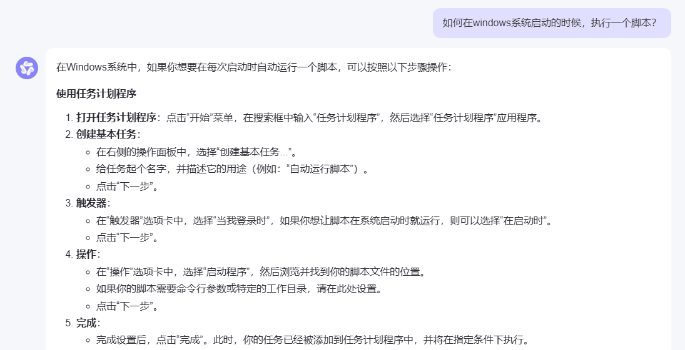

# sstm-daily-login-reward
*  Automatically login sstm.moe and get daily login reward
*  Versions
   *  Chrome 130.0.6723.70 (win64)
   *  ChromeDriver 130.0.6723.69 (win64)
      *  Downloaded from https://googlechromelabs.github.io/chrome-for-testing/#stable
   *  etc (Details in `Cargo.toml`)
*  **How to use?**
   1. Rename `.env.template` to `.env`
   2. Fill `.env` file
   3. Download `chromedriver.exe` and put it in `./bin/` folder
   4. Start this tool by `cargo run`
* Optional
  * Add it to `Windows任务计划程序`
  * 
